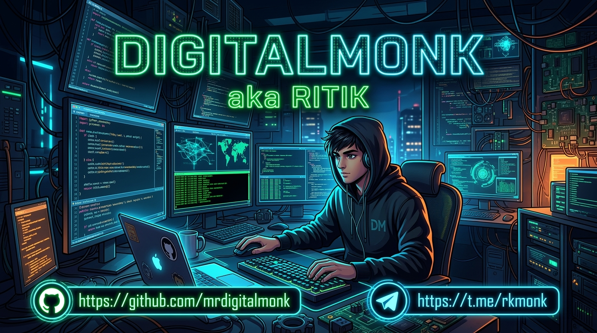

  

<h1 align="center">⚡ DigitalMonk ⚡</h1>
<h3 align="center">Cybersecurity • Automation • Linux</h3>

  

---

### 🧠 About Me
- 🔐 **Focus:** Cybersecurity Explorer
- 🌱 **Currently Learning:** Cybersecurity | Python Automation | Linux Internals | Networking Basics
- 🚀 **Goals:** Always exploring new tech & building digital projects

---

### 💻 Current Projects
- 🛠️ DataGen
- 👻 GhostMask
- 🤖 Automation Scripts

---

### 🛠 Tech Stack & Tools I Use

**Languages & Core Skills:** 

**Tools & Platforms:** 

---

### 🏆 Profile Trophies

  

---

### 📊 Profile Stats

  
  

---

### 🐍 GitHub Activity

  

---

### 👀 Profile Visitors

  

---

### 🤝 Connect With Me

  
  

---

  <b>⚡ DigitalMonk | Ritik</b> 
  <i>⚡ Exploring • Building • Learning</i>

